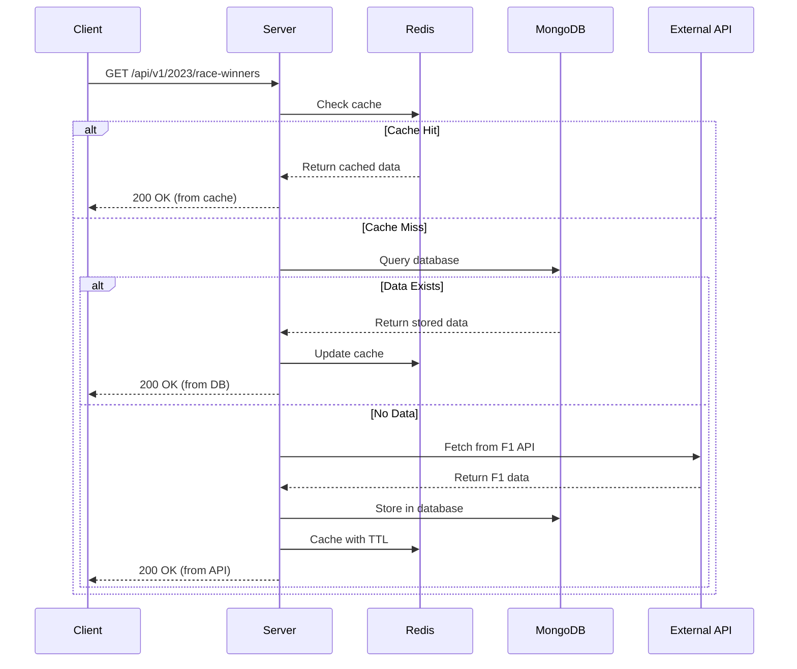

# F1 Champions - Architecture Documentation

## Table of Contents
1. [Overview](#overview)
2. [System Architecture](#system-architecture)
3. [Technology Stack](#technology-stack)
4. [Project Structure](#project-structure)
5. [Data Flow](#data-flow)
6. [Key Components](#key-components)
7. [API Design](#api-design)
8. [Database Schema](#database-schema)
9. [Caching Strategy](#caching-strategy)
10. [Security Architecture](#security-architecture)
11. [Deployment Architecture](#deployment-architecture)
12. [Development Workflow](#development-workflow)

## Overview

F1 Champions is a full-stack web application that displays Formula 1 season champions and race winners. The application is built as a monorepo using Nx workspace, featuring a Next.js frontend and Express.js backend with MongoDB persistence and Redis caching.

### Key Features
- Display F1 season champions from 1950 to present
- Show detailed race winners for each season
- Real-time data synchronization with external F1 API
- Multi-layer caching for optimal performance
- Responsive Material-UI design with dark/light theme support

## System Architecture

### High-Level Architecture Diagram

```
┌─────────────────────────────────────────────────────────────────┐
│                          Client (Next.js)                         │
│  ┌─────────────┐  ┌──────────────┐  ┌─────────────────────┐    │
│  │   React 19  │  │ Redux Toolkit │  │   Material-UI v7    │    │
│  │ Components  │  │  + RTK Query  │  │   + Emotion CSS     │    │
│  └─────────────┘  └──────────────┘  └─────────────────────┘    │
└───────────────────────────┬─────────────────────────────────────┘
                            │ HTTP/REST
                            ▼
┌─────────────────────────────────────────────────────────────────┐
│                      API Gateway (Express.js)                     │
│  ┌─────────────┐  ┌──────────────┐  ┌─────────────────────┐    │
│  │   Routes    │  │ Controllers  │  │    Middleware       │    │
│  │  /api/v1/*  │  │  + Validation │  │ Security/Logging    │    │
│  └─────────────┘  └──────────────┘  └─────────────────────┘    │
└───────────────────────────┬─────────────────────────────────────┘
                            │
                            ▼
┌─────────────────────────────────────────────────────────────────┐
│                        Service Layer                              │
│  ┌─────────────────────┐  ┌────────────────────────────────┐    │
│  │  Business Logic     │  │   External API Integration    │    │
│  │  Data Transformation│  │   Retry Logic & Fallbacks    │    │
│  └─────────────────────┘  └────────────────────────────────┘    │
└───────────────────────────┬─────────────────────────────────────┘
                            │
        ┌───────────────────┴───────────────────┐
        ▼                                       ▼
┌──────────────────┐                   ┌──────────────────┐
│   Redis Cache    │                   │    MongoDB       │
│  Session Data    │                   │ Persistent Data  │
│   (1hr TTL)      │                   │   + Indexes      │
└──────────────────┘                   └──────────────────┘
        │                                       │
        └───────────────────┬───────────────────┘
                            ▼
                    ┌──────────────────┐
                    │ External F1 API  │
                    │ api.jolpi.ca     │
                    └──────────────────┘
```

### Architectural Patterns

#### 1. **Monorepo Architecture**
- Centralized dependency management
- Shared TypeScript configurations
- Consistent tooling across projects
- Optimized builds with Nx caching

#### 2. **Microservices-Ready Design**
- Clear service boundaries
- API versioning support
- Independent deployment capabilities
- Health check endpoints

#### 3. **Domain-Driven Design**
- Feature-based module organization
- Clear domain boundaries (seasons, races, drivers)
- Rich domain models with business logic

## Technology Stack

### Frontend Technologies
| Technology | Version | Purpose |
|------------|---------|---------|
| Next.js | 15.2.4 | React framework with SSR/SSG |
| React | 19.0.0 | UI library |
| Redux Toolkit | 2.8.2 | State management |
| RTK Query | - | Data fetching and caching |
| Material-UI | 7.2.1 | Component library |
| Emotion | 13.0.0 | CSS-in-JS styling |
| TypeScript | 5.7.2 | Type safety |

### Backend Technologies
| Technology | Version | Purpose |
|------------|---------|---------|
| Express.js | 5.1.0 | Web framework |
| MongoDB | 8.15.0 | Primary database |
| Mongoose | 8.3.4 | MongoDB ODM |
| Redis | 5.1.0 | Caching layer |
| TypeScript | 5.7.2 | Type safety |
| Zod | 3.24.1 | Runtime validation |
| Winston | 3.17.0 | Logging |
| Swagger | - | API documentation |

### DevOps & Infrastructure
| Technology | Purpose |
|------------|---------|
| Docker | Containerization |
| Docker Compose | Local development |
| Nx | Monorepo management |
| Jest | Testing framework |
| ESLint | Code quality |
| Railway | Deployment platform |

## Project Structure

```
f1-champ/
├── apps/
│   ├── client/                 # Next.js frontend application
│   │   ├── src/
│   │   │   ├── app/           # Next.js app router
│   │   │   ├── components/    # React components
│   │   │   ├── redux/         # State management
│   │   │   ├── hooks/         # Custom React hooks
│   │   │   └── styles/        # Global styles and themes
│   │   ├── tests/             # Frontend tests
│   │   └── Dockerfile         # Client container
│   │
│   └── server/                # Express.js backend application
│       ├── controllers/       # Request handlers
│       ├── services/          # Business logic
│       ├── models/            # Mongoose schemas
│       ├── routes/            # API routes
│       ├── middleware/        # Express middleware
│       ├── utils/             # Utility functions
│       ├── ___tests___/       # Backend tests
│       └── Dockerfile         # Server container
│
├── scripts/                   # Deployment and utility scripts
├── patches/                   # Security and performance patches
├── nx.json                    # Nx workspace configuration
├── docker-compose.yml         # Production compose
├── docker-compose.dev.yml     # Development compose
└── package.json              # Root dependencies
```

### Key Directories Explained

#### Client Structure
- **`app/`**: Next.js 15 app router with layouts and pages
- **`components/`**: Feature-based component organization
  - `season/`: Season-related components
  - `races/`: Race table and related components
  - `driver/`: Driver information components
  - `ui/`: Shared UI components (Header, Footer)
- **`redux/`**: Redux store configuration and API slices
- **`hooks/`**: Custom React hooks for shared logic

#### Server Structure
- **`controllers/`**: HTTP request handlers with validation
- **`services/`**: Core business logic and external API integration
- **`models/`**: MongoDB schemas and data models
- **`middleware/`**: Cross-cutting concerns (auth, errors, logging)
- **`utils/`**: Shared utilities (logger, redis client, retry logic)

## Data Flow

### Request Lifecycle

1. **User Interaction**
   - User clicks on a season or navigates to race details
   - React component triggers an action

2. **Client-Side Data Fetching**
   ```typescript
   // RTK Query hook in component
   const { data, isLoading } = useGetRaceWinnersQuery(season);
   ```

3. **API Request**
   - RTK Query sends HTTP request to backend
   - Automatic request deduplication and caching

4. **Server-Side Processing**
   ```typescript
   // Route → Controller → Service flow
   router.get('/:season/race-winners', getRaceWinners);
   
   // Controller validates and delegates
   const raceWinners = await raceWinnersService.getRaceWinners(season);
   ```

5. **Multi-Layer Caching Check**
   ```typescript
   // 1. Check Redis cache
   const cached = await redis.get(`race-winners:${season}`);
   if (cached) return JSON.parse(cached);
   
   // 2. Check MongoDB
   const stored = await Driver.find({ season });
   if (stored.length) {
     await redis.setex(key, 3600, JSON.stringify(stored));
     return stored;
   }
   
   // 3. Fetch from external API
   const data = await fetchFromF1API(season);
   ```

6. **Data Persistence**
   - Store in MongoDB for long-term persistence
   - Cache in Redis with TTL for performance

7. **Response Transformation**
   - Service returns normalized data
   - Controller sends JSON response
   - RTK Query caches and delivers to component

### Data Synchronization



## Key Components

### Frontend Components

#### 1. **SeasonTable Component**
Primary component for displaying F1 seasons with champions.

```typescript
// apps/client/src/components/season/SeasonTable.tsx
- Displays all F1 seasons in a paginated table
- Integrates with RTK Query for data fetching
- Supports row expansion for race details
- Material-UI DataGrid integration
```

#### 2. **RacesTable Component**
Displays race winners for a selected season.

```typescript
// apps/client/src/components/races/RacesTable.tsx
- Shows all races in a season
- Driver modal for detailed information
- Custom cell renderers for race data
- Responsive design with mobile support
```

#### 3. **Redux Store Configuration**
Centralized state management with RTK Query.

```typescript
// apps/client/src/redux/store.ts
- RTK Query API slice configuration
- Automatic cache management
- DevTools integration in development
```

### Backend Services

#### 1. **SeasonChampionsService**
Core service for managing season champion data.

```typescript
// apps/server/services/seasonChampionsService.ts
Key methods:
- getSeasonsWithWinners(): Fetch all champions
- refreshSeasonsData(): Update from external API
- Multi-layer caching implementation
```

#### 2. **RaceWinnersService**
Manages individual race winner data.

```typescript
// apps/server/services/raceWinnersService.ts
Key methods:
- getRaceWinners(season): Get races for a season
- Retry logic for external API calls
- Data transformation and normalization
```

#### 3. **StartupDataLoader**
Pre-warms cache on server startup.

```typescript
// apps/server/services/startupDataLoader.ts
- Loads frequently accessed data
- Reduces cold start latency
- Configurable based on environment
```

## API Design

### RESTful Endpoints

#### Base URL
```
Production: https://api.f1champions.com/api
Development: http://localhost:4000/api
```

#### Endpoints

##### 1. **Health Check**
```http
GET /health
Response: 200 OK
{
  "status": "healthy",
  "timestamp": "2024-01-30T12:00:00Z"
}
```

##### 2. **Get All Season Champions**
```http
GET /v1/champions
Response: 200 OK
[
  {
    "season": "2023",
    "givenName": "Max",
    "familyName": "Verstappen",
    "isSeasonEnded": true
  },
  // ... more seasons
]
```

##### 3. **Get Race Winners by Season**
```http
GET /v1/{season}/race-winners
Parameters:
  - season: string (required) - Year of the season
Response: 200 OK
[
  {
    "driverId": "verstappen",
    "race": [
      {
        "raceName": "Bahrain Grand Prix",
        "date": "2023-03-05",
        "circuitName": "Bahrain International Circuit"
      }
    ],
    "givenName": "Max",
    "familyName": "Verstappen",
    "nationality": "Dutch",
    "teamName": "Red Bull"
  }
]
```

### API Versioning
- Version included in URL path (`/v1/`)
- Backwards compatibility maintained
- Deprecation notices in headers

### Error Responses
```typescript
{
  "error": {
    "code": "RESOURCE_NOT_FOUND",
    "message": "Season data not found",
    "timestamp": "2024-01-30T12:00:00Z"
  }
}
```

## Database Schema

### MongoDB Collections

#### 1. **seasonWinner Collection**
Stores F1 season champion data.

```typescript
{
  _id: ObjectId,
  season: String,           // "2023"
  givenName: String,        // "Max"
  familyName: String,       // "Verstappen"
  isSeasonEnded: Boolean,   // true
  createdAt: Date,
  updatedAt: Date
}
```

Indexes:
- `season`: Unique index for fast lookups
- `createdAt`: For time-based queries

#### 2. **drivers Collection**
Stores detailed driver and race information.

```typescript
{
  _id: ObjectId,
  driverId: String,         // "verstappen"
  season: String,           // "2023"
  givenName: String,        // "Max"
  familyName: String,       // "Verstappen"
  dateOfBirth: String,      // "1997-09-30"
  nationality: String,      // "Dutch"
  permanentNumber: String,  // "1"
  driverUrl: String,        // Wikipedia URL
  teamName: String,         // "Red Bull"
  teamUrl: String,          // Team Wikipedia URL
  race: [{
    raceName: String,       // "Bahrain Grand Prix"
    date: String,           // "2023-03-05"
    circuitName: String,    // "Bahrain International Circuit"
    circuitUrl: String,     // Circuit Wikipedia URL
    lat: String,            // Latitude
    long: String,           // Longitude
    locality: String,       // "Sakhir"
    country: String         // "Bahrain"
  }],
  laps: String,            // Total laps
  time: String             // Total time
}
```

Indexes:
- `{ season: 1, driverId: 1 }`: Compound index
- `season`: For season-based queries

## Caching Strategy

### Multi-Layer Caching Architecture

#### 1. **Client-Side Caching (RTK Query)**
- Automatic request deduplication
- Configurable cache lifetime
- Optimistic updates support
- Cache invalidation on mutations

#### 2. **Redis Caching (Server-Side)**
```typescript
// Cache configuration
const CACHE_TTL = {
  SEASON_CHAMPIONS: 3600,    // 1 hour
  RACE_WINNERS: 3600,        // 1 hour
  DRIVER_DETAILS: 7200       // 2 hours
};

// Cache key patterns
`season-champions:all`
`race-winners:${season}`
`driver:${driverId}:${season}`
```

Benefits:
- Sub-millisecond response times
- Reduced database load
- Automatic expiration
- Cluster support ready

#### 3. **MongoDB Persistence**
- Long-term data storage
- Complex query support
- Data integrity guarantees
- Backup and recovery

### Cache Invalidation Strategy

1. **Time-Based Expiration**
   - Redis TTL for automatic cleanup
   - Different TTLs based on data volatility

2. **Event-Based Invalidation**
   - Clear cache on data updates
   - Webhook support for external updates

3. **Manual Invalidation**
   - Admin endpoints for cache clearing
   - Selective invalidation by key pattern

## Security Architecture

### Application Security Measures

#### 1. **API Security**
```typescript
// Helmet for security headers
app.use(helmet({
  contentSecurityPolicy: {
    directives: {
      defaultSrc: ["'self'"],
      styleSrc: ["'self'", "'unsafe-inline'"],
      scriptSrc: ["'self'"],
      imgSrc: ["'self'", "data:", "https:"],
    },
  },
}));

// CORS configuration
app.use(cors({
  origin: process.env.ALLOWED_ORIGINS?.split(','),
  credentials: true,
  optionsSuccessStatus: 200
}));
```

#### 2. **Rate Limiting**
```typescript
// Per-IP rate limiting
const limiter = rateLimit({
  windowMs: 15 * 60 * 1000,  // 15 minutes
  max: 100,                   // 100 requests per window
  standardHeaders: true,
  legacyHeaders: false,
});
```

#### 3. **Input Validation**
- Zod schemas for runtime validation
- MongoDB injection prevention
- SQL injection protection (for future features)
- XSS prevention through proper encoding

#### 4. **Authentication & Authorization**
- Currently public API
- JWT-ready architecture
- Role-based access control structure

### Data Security

1. **Database Security**
   - Connection string encryption
   - Database user permissions
   - Network isolation in production

2. **Sensitive Data Handling**
   - Environment variables for secrets
   - No sensitive data in logs
   - Secure cookie configuration

3. **Transport Security**
   - HTTPS enforcement in production
   - Secure headers (HSTS, X-Frame-Options)
   - Certificate pinning ready

## Deployment Architecture

### Container Architecture

#### 1. **Docker Configuration**

**Client Dockerfile** (Multi-stage build):
```dockerfile
# Build stage
FROM node:22-alpine AS builder
WORKDIR /app
COPY . .
RUN npm ci && npm run build:client

# Production stage
FROM node:22-alpine
WORKDIR /app
COPY --from=builder /app/dist/apps/client ./
EXPOSE 3000
CMD ["node", "server.js"]
```

**Server Dockerfile**:
```dockerfile
FROM node:22-alpine
WORKDIR /app
COPY dist/apps/server ./
COPY node_modules ./node_modules
EXPOSE 4000
CMD ["node", "server.js"]
```

#### 2. **Docker Compose Setup**

**Production** (`docker-compose.yml`):
```yaml
services:
  client:
    build: ./apps/client
    ports:
      - "3000:3000"
    environment:
      - NEXT_PUBLIC_API_URL=http://server:4000
    depends_on:
      - server

  server:
    build: ./apps/server
    ports:
      - "4000:4000"
    environment:
      - DB_HOST=mongodb://mongo:27017/f1db
      - REDIS_URL=redis://redis:6379
    depends_on:
      - mongo
      - redis

  mongo:
    image: mongo:7
    volumes:
      - mongo_data:/data/db

  redis:
    image: redis:7-alpine
    command: redis-server --appendonly yes
    volumes:
      - redis_data:/data
```

### Production Deployment

#### Railway Deployment
1. **Automatic Deployments**
   - GitHub integration
   - Branch-based deployments
   - Rollback capabilities

2. **Environment Management**
   - Secure environment variables
   - Per-environment configuration
   - Secret rotation support

3. **Scaling Strategy**
   - Horizontal scaling support
   - Load balancer ready
   - Auto-scaling rules

### Monitoring & Observability

1. **Health Checks**
   ```typescript
   app.get('/health', (req, res) => {
     res.json({
       status: 'healthy',
       uptime: process.uptime(),
       timestamp: new Date().toISOString()
     });
   });
   ```

2. **Logging Strategy**
   - Winston for structured logging
   - Log levels by environment
   - Centralized log aggregation ready

3. **Metrics Collection**
   - Response time tracking
   - Error rate monitoring
   - Cache hit/miss ratios

## Development Workflow

### Local Development Setup

1. **Prerequisites**
   ```bash
   - Node.js 22+
   - Docker & Docker Compose
   - MongoDB (via Docker)
   - Redis (via Docker)
   ```

2. **Initial Setup**
   ```bash
   # Clone repository
   git clone https://github.com/yourusername/f1-champ.git
   cd f1-champ

   # Install dependencies
   npm install

   # Start infrastructure
   docker-compose -f docker-compose.dev.yml up -d

   # Run development servers
   nx run-many --target=dev --projects=client,server --parallel
   ```

3. **Development URLs**
   - Frontend: http://localhost:3000
   - Backend: http://localhost:4000
   - API Docs: http://localhost:4000/api-docs

### Nx Commands Reference

```bash
# Development
nx dev client              # Start client dev server
nx dev server              # Start server dev server
nx run-many --target=dev   # Start both

# Building
nx build client            # Build client for production
nx build server            # Build server for production
nx run-many --target=build # Build both

# Testing
nx test client             # Run client tests
nx test server             # Run server tests
nx test client --watch     # Watch mode

# Code Quality
nx lint client             # Lint client code
nx lint server             # Lint server code
nx typecheck server        # TypeScript check

# Utilities
nx graph                   # View dependency graph
nx reset                   # Clear Nx cache
```

### Testing Strategy

#### Frontend Testing
- **Unit Tests**: React Testing Library
- **Component Tests**: Isolated component testing
- **Integration Tests**: RTK Query mocking
- **E2E Tests**: Cypress (future implementation)

#### Backend Testing
- **Unit Tests**: Service and utility testing
- **Integration Tests**: API endpoint testing
- **Database Tests**: MongoDB memory server
- **Performance Tests**: Load testing with k6

### Code Quality Standards

1. **TypeScript Configuration**
   - Strict mode enabled
   - No implicit any
   - Consistent return types

2. **ESLint Rules**
   - Airbnb configuration base
   - Custom rules for consistency
   - Pre-commit hooks

3. **Code Review Process**
   - PR templates
   - Automated checks
   - Required approvals

### CI/CD Pipeline

1. **Continuous Integration**
   ```yaml
   - Lint checks
   - TypeScript compilation
   - Unit tests
   - Integration tests
   - Build verification
   ```

2. **Continuous Deployment**
   ```yaml
   - Automated deployments to staging
   - Manual promotion to production
   - Rollback capabilities
   - Health check validation
   ```

## Performance Considerations

### Frontend Optimization
1. **Next.js Optimizations**
   - Automatic code splitting
   - Image optimization
   - Font optimization
   - Static generation where possible

2. **Bundle Size Management**
   - Tree shaking
   - Dynamic imports
   - Component lazy loading

### Backend Optimization
1. **Database Optimization**
   - Indexed queries
   - Connection pooling
   - Query optimization

2. **Caching Effectiveness**
   - High cache hit rates (>90%)
   - Appropriate TTLs
   - Warm cache on startup

### Scalability Considerations
1. **Horizontal Scaling**
   - Stateless application design
   - Session storage in Redis
   - Database connection pooling

2. **Vertical Scaling**
   - Memory optimization
   - CPU utilization monitoring
   - Resource allocation tuning

## Future Enhancements

### Planned Features
1. **Real-time Updates**
   - WebSocket integration
   - Live race data during events
   - Push notifications

2. **Advanced Analytics**
   - Driver performance trends
   - Team statistics
   - Historical comparisons

3. **User Features**
   - User accounts and preferences
   - Favorite drivers/teams
   - Custom notifications

### Technical Improvements
1. **GraphQL API**
   - Alongside REST API
   - Subscription support
   - Better query efficiency

2. **Microservices Migration**
   - Service decomposition
   - Independent scaling
   - Event-driven architecture

3. **Enhanced Monitoring**
   - APM integration
   - Distributed tracing
   - Advanced alerting

## Conclusion

The F1 Champions application demonstrates modern full-stack development best practices with a focus on performance, scalability, and maintainability. The architecture supports future growth while maintaining simplicity for current requirements. The multi-layer caching strategy ensures optimal performance, while the monorepo structure provides excellent developer experience and code reusability.